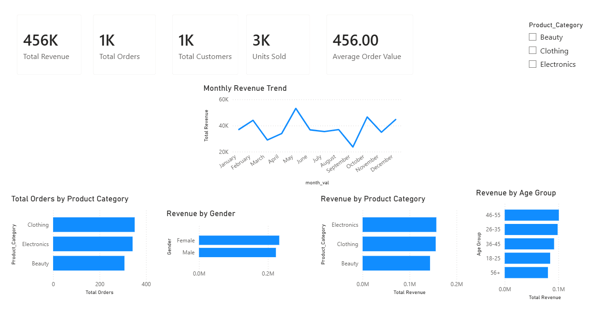

# Retail Sales Analysis Dashboard

## Project Goal

Analyse retail sales data to identify customer purchasing patterns, revenue trends and product category performance.

## Dataset

The dataset contains 1,000 retail transactions including customer demographics, product categories, quantities purchased, and sales revenue.

## Workflow

 - Load CSV retail sales data.
 - Clean CSV data using pandas.
 - Save cleaned data to SQL database.
 - Perform exploratory data analysis using pandas.
 - Use SQL to run queries looking into customer demographics, revenue trends etc.
 - Exported cleaned retail sales data as CSV.
 - Use Power BI to visualise analysis.

## Tools Used

 - Python
 - SQLite - querying cleaned data
 - Pandas - data cleaning and analysis
 - Plotly - visualisation
 - Power BI - dashboard creation

## Analysis Performed

 - Revenue analysis (total revenue, average order, sales trends)
 - Product Analysis (category and order values)
 - Customer analysis (age groups and gender)
 - Time Analysis (monthly and weekday patterns)
 - Outlier analysis (distribution and transaction checks)

## Results

### Key Findings

- Electronics generated the highest total revenue.
- Clothing had the highest number of orders.
- Revenue remained relatively stable throughout the year with no clear seasonal pattern.
- Customer demographic analysis showed limited differences between groups.

### Limitations

- Data set only contained 1 year worth of transactions.
- Each customer appeared once in the dataset.
- Dataset only contained revenue, so no profit analysis could be performed.

## Dashboard

